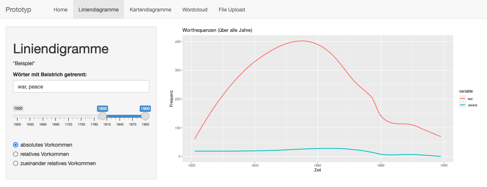
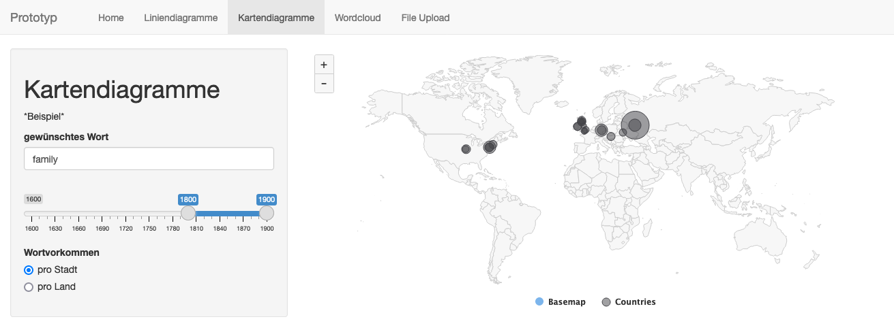
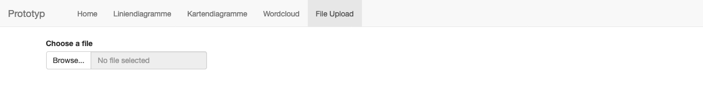

## What happened so far?

Well... it's been more than three months that we've been working on this project. During this time, we've been busy with a lot of things. While working on our diploma thesis, we made progress in nearly every aspect of our project. Together with the backend team, and after a many meetings, we finally managed to set up a foundation for our data pipeline that supports our use case. As the literature data we are working with turned out to be quite different from what we've expected, we had to adapt the topic extraction technique used for topic clustering to support such large amounts of text (we are talking hundreds of pages per text here). Despite the hard work, we've overcome this issues and hereby proudly present our first prototype.

## Announcing our first prototypes

Our [prototype](https://textminr.shinyapps.io/TextminR_Prototyp/) is a web application (similar to the one mentioned in the previous project update) based (again) on the [Shiny](https://shiny.posit.co/) framework. It is fully integrated with the API and database created by the backend team and allows you to explore a smaller amount of data collected so far:

Nicolas implemented common features like *Word of the Day*, *Word Frequencies over Time* and maps to display word occurences all over the world. In addition, our final product will support uploading your own texts to let you explore them with our tool, so our minimalistic upload page will of course be extended:

## Next steps

Due to slight delays we are not yet able to present the core of our project: topic extraction. For our final product, we decided to make more visually appealing visualizations to enhance user experiece even further by implementing interactive visualizations. However, this will be covered in detail in the following project updates. Stay tuned! 
