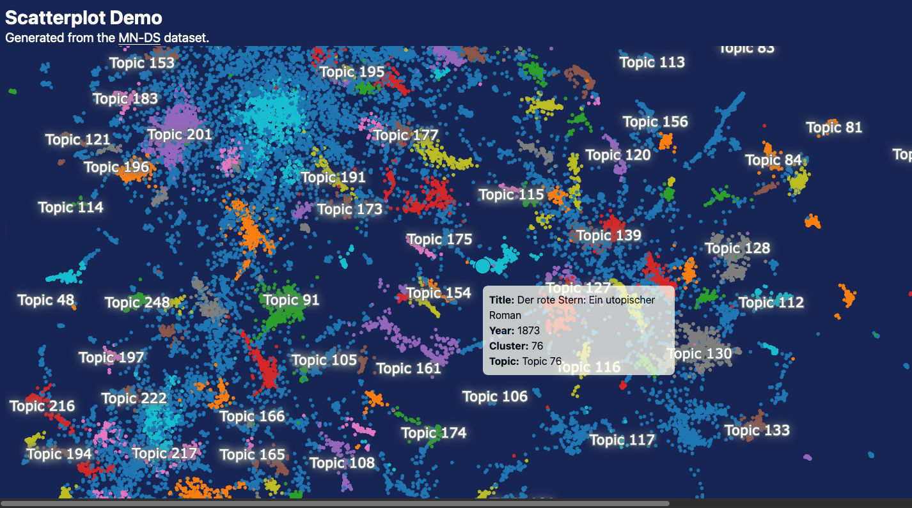

## What happened so far?

During the past few weeks, our backend team excessively worked on deploying a reliable database and API to store and access our data. With that established, they were able to upload and process literature data from [Project Gutenberg](https://www.gutenberg.org/) from the 19th century in both German and English. This data is now available for us to work with.

## Our basic topic extraction

Given this huge amount of data, we had to search for appropriate vizualization techniques to make the data accessible and understandable for our users. In addition, we opt to make it possible to explore the extracted topics in an interactive way. Therefore, we decided to integrate a scatter plot to visualize the topics. In a nutshell, every text we are working with is represented by a point in this scatter plot. The absolute position of these points has no meaning, but the distance between them does. The closer two points are, the more similar the texts are. This way, we can easily identify clusters of texts based on the topics they cover. This plot is temporarily available [here](https://topics.textminr.tech). 

It allows zooming into the plot and hovering over the points to see the title of the text and the topics it covers. In addition, try to click on a specific topic - you will see how other texts are removed from the plot, leaving only the texts that cover the selected topic. If you click on the same topic again, all texts will be displayed again.

## Next steps

We have now taken the first steps toward providing a user-friendly interface for our users to explore the data. As you see in the picture above, the topics are not yet labeled. This is the next step we are working on. This will be the last major feature before finishing the project. Stay tuned for our final update!